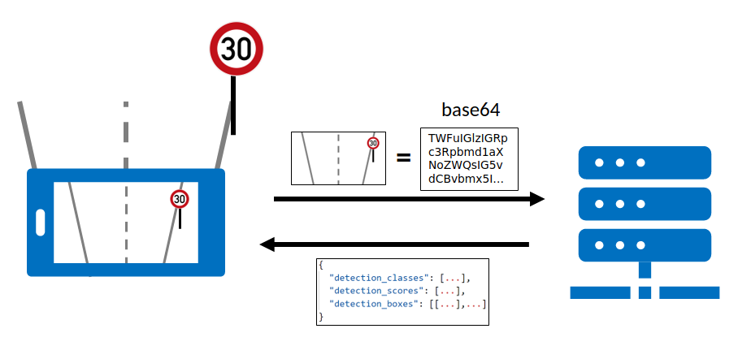

# Client

Um die BErechnung der KI zu beschleunigen, wird in diesem Fall die Berechnung auf einem Server ausgelagert.

Der Client(Smartphone) macht also lediglich das Bild und schickt dieses an den Server. Dieser Analysiert das Bild und sendet das ergebnis zurück an den Client.

{: style="width:60%;"}

## Bild aufnehmen

Um ein Bild aufzunehmen kann der vom Expo-Framework bereitgestellte Component `Camera` benutzt werden.

```html
<Camera
  style={styles.camera}
  ref={cameraRef}
  onCameraReady={loopRequests}
></Camera>
```

Hierzu wird dem Component ein Referenz-Objekt übergeben, sowie eine Methode welche aufgerufen wird, wenn die Kamera ferig geladen ist.

**loopRequests()**

```ts
const loopRequests = async () => {
  while (loop) {
    await takePicture();
  }
};
```

solange die Variablen `loop` auf *true* gesetzt ist, wird die Methode `takePicture()` aufgerufen.

Beim Laden des Components ist wird `loop` mit *true* initialisiert. Sobald der Component entladen wird, wird die Variable auf *false* gesetzt, sodass keine weiteren Fotos gemacht werden.

**takePicture()**

In dieser Methode wird auf das Referenz-Objekt der Kamera die Methode `takePictureAsync()` aufgerufen.

Da das Fotografieren ohne Optimierung ca. 2-3 Sekunden dauert, muss dieser Vorgang durch das Übergeben von Parametern optimiert werden.

```ts
await cameraRef.current?.takePictureAsync({
  skipProcessing: true,
  onPictureSaved: (pic) => sendImage(pic),
});
```

- **skipProcessing**:  
überspringt die Anpassungen der Orientierung des Bildes.

- **onPictureSaved**:  
Ein Callback, welcher denn Prozess des Abspeichern des Bildes überspringt.

## Anfrage senden

**sendImage()**

Die Methode `sendImage()` manipuliert zuerst das Bild, damit der Request keine zu großen Daten senden muss. Im Anschluss daran wird das Bild als base64 an den Server gesendet.

```ts
const sendImage = async (img: CameraCapturedPicture | undefined) => {
  ...
  const newImg = await ImageManipulator.manipulateAsync(
    img.uri,
    [{ resize: { height: 1080, width: 1920 } }],
    { compress: 0.35, base64: true }
  );
  ...
};
```

Die Methode `manipulateAsync` wird vom Expo-Framework bereitgestellt. Mit Hilfe dieser Methode wird das Foto auf FullHD skaliert, auf den Faktor 0.35 komprimiert und als base64 encodiert.

Im Anschluss wird mit der Methode `postImage()` das base64 encodierte Bild an den Server gesendet.

```ts
const result: ImageResult = await postImage(newImg.base64);
```

## Antwort bearbeiten

Die Antwort des Servers ist vom Typ `ImageResult`.

```ts
export interface ImageResult {
  detection_classes: number[];
  detection_scores: number[];
  detection_boxes: number[][];
}
```

**detection_classes**  
ein Array aus Zahlen, welches die erkannten Label-Klassen beinhaltet.

**detection_scores**  
Beinhaltet die Wahrscheinlichkeiten für die erkannten Klassen.

**detection_boxes**  
Beinhaltet die Koordinaten der erkannten Label-Boxen.

Um nun das erkannte Schild in der App anzuzeigen, wird aus dem Array `detection_scores` der Index des großte Wertes genommen, um das Schild mit der höchsten Wahrscheinlichkeit anzuzeigen.

```ts
const idx = result.detection_scores.indexOf(
  Math.max(...result.detection_scores)
);
```

Daraufhin wird überprüft, ob dieser Wert größer oder gleich 0,8 ist. Dieser Wert ergibt sich aus dem Testen der KI. Wir haben festgestellt, dass Schilder welche mit einer Wahrscheinlichkeit von 80% oder höher erkannt werden, immer richtig erkannt wurden.

```ts
result.detection_scores[idx] >= 0.8
```

Ebenfalls wird die Boxgröße der erkannten Labels gecheckt, da häufiger falsche Label über den ganzen Bildschirm erkannt wurden. Weil die App für das Filmen aus einem Auto heraus konzipiert ist, können diese Labels herausgefiltert werden, da aufgrund der Perspektive ein Schild nicht den ganzen Bildschirm einnehmen kann.

```ts
!checkSize(result.detection_boxes[idx])
```

Sind beide Bedingungen erfüllt wird die Klasse in der Variablen `sign` gespeichert.