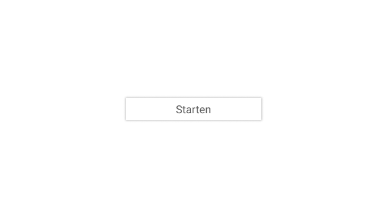
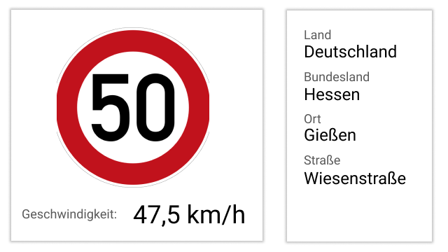
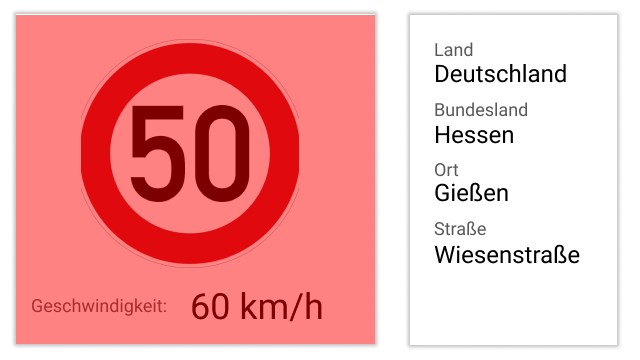
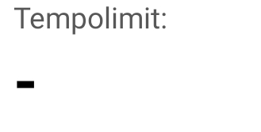
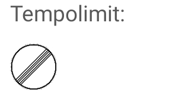
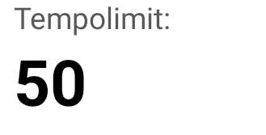

## Konzept

### Features

- Anzeige des zuletzt erkannten Schildes, welches das Tempolimit beeinflusst
- Anzeige des aktuellen Standortes
- Anzeige der aktuellen Geschwindigkeit
- Warnhinweis bei Überschreitung des aktuellen Tempolimits

### Mock-Up

Um die genannten Features sinnvoll in einer App zu verpacken, wurde zuerst ein Mock-up mithilfe
von [Figma](https://www.figma.com) erstellt.

Die App soll nur im Querformat nutzbar sein, damit die Fotos, welche das Smartphone macht, ebenfalls im Querformat
entstehen und somit mit höherer Wahrscheinlichkeit ein Straßenschild erkannt werden kann.

**Startscreen**

{: style="width:60%; border: 1px solid black;"}

Damit der Benutzer nicht direkt beim Öffnen der App mit dem Tracking der Umgebung beginnt, soll es zuerst einen
Startbildschirm geben, auf welchem der Benutzer bewusst die Anwendung starten kann.

**Detectionscreen**

{: style="width:60%; border: 1px solid black;"}

Wird dann die App durch das Drücken auf den *Start-Button* gestartet, so wird der Benutzer auf den *detectionscreen*
geleitet. Dort soll dem Benutzer auf der linken Seite das zuletzt erkannte Schild als Bild angezeigt werden, sowie auch
die aktuelle Geschwindigkeit angezeigt werden. Auf der rechten Seite soll dem Benutzer der aktuelle Standort angezeigt
werden.

Wird das aktuelle Tempolimit überschritten, so soll sich die linke Seite der App rot färben, um den Benutzer auf die
Überschreitung hinzuweisen.

{: style="width:60%; border: 1px solid black;"}

## Labels

Damit die App das passende Bild, sowie die richtige Geschwindigkeit anzeigt, werden für jede Klasse, welche die KI
zurückgibt, ein Objekt vom Typ `Label` in einem Record gespeichert.

### Interface Label

```ts
export interface Label {
    value: number;
    name: string;
    image: any;
    baseSpeed?: number;
}
```

**value**  
Schild mit Tempolimit:  
In `value` wird das Tempolimit zum erkannten Schild gespeichert.

Schild mit Auflösung eines Tempolimits:  
In `value` wird der Wert `-1` gespeichert.

**name**  
Speichert den Namen des Labels zu der zugehörigen Klasse.

**image**  
Speichert den Pfad zum Bild, welches bei dem Erkennen des Labels in der App angezeigt werden soll.

**baseSpeed**  
Speichert die Grundgeschwindigkeit.  
Ort = 50, außerorts = 100, Autobahn = Number.MAX_SAFE_INTEGER (unbegrenzt)

## Umsetzung

### Detectionscreen

**Geschwindigkeitsanzeige**

Um die aktuelle Geschwindigkeit des Smartphones anzuzeigen, nutzen wir die Bibliothek *expo-location* des
Expo-Frameworks.

Dazu wird beim Laden des Screens die Methoden `watchPositionAsync` aufgerufen. Dieser Methode wird ein Objekt übergeben,
in welchem man die Genauigkeit *(accuracy)* und das Zeitintervall *(timeInterval in ms)* festlegen kann.

```ts
  await Location.watchPositionAsync(
    {
        accuracy: Location.Accuracy.BestForNavigation,
        timeInterval: 500,
    }
);
```

Ebenso kann man der Methode eine Funktion übergeben, welche nach jedem Positionsupdate aufgerufen wird.

```ts
  await Location.watchPositionAsync(
    {
        accuracy: Location.Accuracy.BestForNavigation,
        timeInterval: 500,
    },
    async (loc) => {
        setLocation(loc);
        const address = await Location.reverseGeocodeAsync(loc.coords);
        setGeo(address);
    }
);
```

In unserem Fall nutzen wir dies, um die neuste Position in einer Variablen zu speichern, (`setLocation(loc);`), sowie
mithilfe der Methode `reverseGeocodeAsync(loc.coords)`, welcher wir die Position übergeben, die genaue Adresse
herauszubekommen.

Da wie im Mock-up beschrieben, sich die Oberfläche in zwei Teile aufteilt, gibt es in React Native dafür zwei
Komponenten.

### SpeedPaper

Diesem Component wird das Positionsobjekt übergeben, welches in der Callback-Methode gesetzt wurde.

Der Component beinhaltet mehrere Variablen:

**tolerance**

Die Variable `tolerance` beinhaltet eine Nummer, welche den Toleranzbereich beschreibt, welcher beim Überschreiten des
Tempolimits für die Warnung gilt. Dieser beträgt 5.

**sign**

In der Variablen `sign` wird die Klasse des aktuell erkannten Bild gespeichert. Mithilfe dieser Variable, kann das auf
das passende Label Objekt im abgespeicherten Record zugegriffen werden, um somit auf den Bildpfad, das Tempolimit oder
den baseSpeed zugreifen zu können.

**memSpeedLimit**

Hier wird der zuletzt erkannte baseSpeed eines Labels gespeichert.

**speedLimit**

Die Variable `speedLimit` wir bei jeder Veränderung der Variablen `sign` gesetzt. Hierzu nutzen wir die von React
definierte Hook `useMemo`.

```ts
  const speedLimit = useMemo(() => {
    if (labels[sign].value === -1) {
        return memSpeedLimit;
    } else {
        const baseSpeed: number | undefined = labels[sign].baseSpeed;
        if (baseSpeed) setMemSpeedLimit(baseSpeed);
        return labels[sign].value;
    }
}, [sign]);
```

Zuerst wird überprüft, ob das erkannte Schild eines ist, welches ein Tempolimit-Schild auflöst.

```ts
if (labels[sign].value === -1) {
    return memSpeedLimit;
}
```

ist dies der Fall, so wird das Tempolimit auf den zuletzt gespeicherten baseSpeed zurückgegeben.

Sollte dies nicht der Fall sein, wird überprüft, ob das erkannte Schild ein baseSpeed enthält, das heißt, ob diese
Variable definiert ist.

```ts
if (baseSpeed) setMemSpeedLimit(baseSpeed);
```

Ist dies der Fall, wird die Variable `memSpeedLimit` auf den baseSpeed gesetzt.

Danach wird der value vom Label zurückgegeben. Dieser ist dann das aktuelle Speedlimit.

```ts
return labels[sign].value;
```

**speed**

Auch die Variable Speed wird mithilfe der Hook `useMemo` gesetzt. Hierbei wird diese jedes mal neu gesetzt, wenn sich
die den Komponenten übergebene Position verändert.

```ts
const speed = useMemo(
    () =>
        location?.coords.speed
            ? (Math.round(location?.coords.speed * 3.6 + Number.EPSILON) * 100) /
            100
            : 0,
    [location?.coords.speed]
);
```

**Anzeige des Bildes**

Um das passende Bild in der App anzuzeigen wird lediglich dem Image-Component von React Native der passende Pfad
übergeben.

Dieser wird mithilfe der erkannten Klasse, welche in `sign` gespeichert ist aus dem Record geholt.

```html

<Image
        ...
        source={labels[sign].image}
></Image>
```

**Anzeige des Tempolimits**

Um das passende Tempolimit anzuzeigen, wird die Funktion `renderLimit` aufgerufen.

- **speedLimit = `MAX_SAFE_INTEGER - 1`**  
  `MAX_SAFE_INTEGER - 1` ist der Wert mit welchem `speedLimit` initialisiert wird.  
  In diesem Fall wird beim Tempolimit ein "-" angezeigt, da noch kein Schild erkannt wurde.

{: style="width:20%; border: 1px solid black;"}

- **speedLimit = `MAX_SAFE_INTEGER`**  
  Ist das speedLimit `MAX_SAFE_INTEGER` so befindet sich der Benutzer auf einer Autobahn und die Geschwindigkeit ist
  unbegrenzt.  
  Angezeigt wird ein Auflösungs-Schild.

{: style="width:20%; border: 1px solid black;"}

- **speedLimit = number**  
  Ist das speedLimit eine Zahl, so wird das Limit auf diese Zahl gesetzt.

{: style="width:20%; border: 1px solid black;"}

#### Warnung bei Überschreitung des Tempolimits

Damit der Bildschirm wie im Mock-up gezeigt bei Überschreitung des Tempolimits rot wird, wird der rote Screen nur
angezeigt, sollte die aktuelle Geschwindigkeit größer als das Tempolimit plus Toleranz sein.

```html
{speed > speedLimit + tolerance ? (
<View style={style.warning}></View>
) : null}
```

Ebenfalls wir bei jeder Veränderung des Tempos eben diese Bedingung überprüft und bei Überschreitung ein Sound mithilfe
der Methode `playSound` abgespielt.

```ts
const playSound = async () => {
    const {sound} = await Audio.Sound.createAsync(
        require("../../assets/sounds/warning.mp3")
    );

    sound?.playAsync();
};
```

Hier wird mithilfe der Methode `createAsync` des Expo-Frameworks ein beliebiger Sound geladen und mit `playAsync`
abgespielt.

### LocationPaper

Im Rechten Teil des Bildschirm wird der Component `LocationPaper` angezeigt. Dieser bekommt lediglich die im
Detectionscreen gesetzte Adresse übergeben und zeigt diese an.

