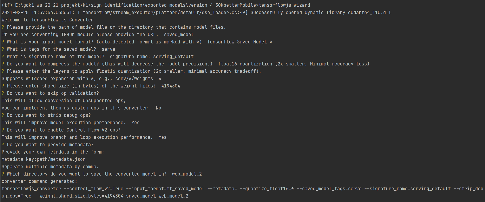
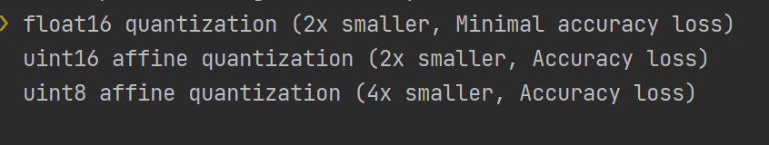

# Tensorflow JS

Um das Trainierte KI modell in React Native zu verwenden, war unsere erste
Idee [Tensorflow Js](https://www.tensorflow.org/js) zu verwenden. Da diese wird seit dem 04.02.2020[^1] eine Offiziell
unterstütztung für **React Native** bietet.

## Konvertierung

Um ein Tensorflow modell in Tensorflow Js zu verwenden muss dieses erst in ein Format Konvertiert werden welches
Tensorflow Js verwenden kann. Hierfür bietet Tensorflow
einen [Converter](https://www.tensorflow.org/js/guide/conversion) an.

{: style="height:350px;width:600px"}

Die konvertierung eines Modells funktioniert sehr einfach, die konvertierung kann mit dem
Konsolenbefehl `tensorflowjs_wizard` gestartet werden. Danach kommen eine Vielzahl von Einstellungen die vorgenommen
werden müssen:
{: style="width:100%"}

Die Einstellungen wie oben angegeben wurden für alle unsere Tensorflow-JS Models verwendet. Es gibt zudem bereits hier
Komprimierungsmöglichkeiten. Den größten Performance Boost hatten wir mit der float16 quantization festgestellt.
{: style="width:100%"}

Der Output dieser Konvertierung (`model.json`, `group1-shard*of*.bin`) kann man dann mit TensorflowJs laden und
verwenden (siehe [Vorhersage](#vorhersage)).

## Installation

Um TensorflowJs in React Native zu Verwenden müssen einige Packages installiert werden. Eine Anleitung der benötigten
schritte befindet sich [hier](https://www.npmjs.com/package/@tensorflow/tfjs-react-native#expo-compatibility).

!!! tip 
    Zwar steht in der Dokumentation von TensorflowJs für React Native das einige Funktionen wie zum
    Beispiel [bundleResourceIO](https://js.tensorflow.org/api_react_native/latest/#bundleResourceIO) nicht
    mit [Expo](https://expo.io/) funktionieren, diese konnten wir allerdings ohne Probleme Verwenden.

!!! warning 
    Damit [Schritt 3](https://www.npmjs.com/package/@tensorflow/tfjs-react-native#step-3-configure-metro) der
    Anleitung funktioniert kann es sein das man noch das
    Package [`@expo/metro-config`](https://www.npmjs.com/package/@expo/metro-config) installiert werden muss.

## Vorhersage

Um Tensorflow Js in React Native verwenden zu können muss dieses erst initalisiert werden.
Dies sollte beim Anzeigen eines Komponeten passieren welcher Tensorflow Js verwendet.

```ts
import * as tf from "@tensorflow/tfjs";
import React, { useEffect, useState } from "react";

export const Camera = () => {
  const [isTfReady, setIsTfReady] = useState(false);

  useEffect(() => {
    const initTf = async () => {
    // Wait for tf to be ready.
    await tf.ready();

    // Signal to the app that tensorflow.js can now be used.
    setIsTfReady(true);
  };

  //...
```

!!! warning
    Hierbei ist es wichtig das man erst das Tensorflow Object (`tf`) verwendet nachdem `tf.ready();` erflogreich ausgeführt wurde. Hierfür wurde der State `isTfReady`
    gesetzt um die Komponenten erst nach dem Initalisieren anzuzeigen.

Wenn Tensorflow initalisiert wurde kann das Vorher exportierte Modell geladen werden. Hierfür werden die Tensorflow funktionen `loadGraphModel` und `bundleResourceIO` verwendet.

```ts
  // model.json
  const jsonModel = require("../../assets/v5-detector_3/model.json");
  // weights
  const weights = [
    require("../../assets/v5-detector_3/group1-shard1of2.bin"),
    require("../../assets/v5-detector_3/group1-shard2of2.bin"),
  ];

  const model = await tf.loadGraphModel(bundleResourceIO(jsonModel, weights));
```

!!! tip
    um das model Später zu verwenden sollte dieses in einem State gespeichert werden.

Nach dem Erflogreichen laden des Modells kann dieses nun Verwendet werden. Hierfür bietete Tensorflow die Funktion `executeAsync`[^2].

```ts
import * as tf from "@tensorflow/tfjs";

export const predict = async (
  model: tf.GraphModel | undefined,
  nextImageTensor: any
): Promise<PredictionResult[]> => {
  if (!model) return [];

  // Vorhersage machen
  const res = ((await model?.executeAsync(
    nextImageTensor?.expandDims(0)
  )) as any) as tf.Tensor[];

  //...
};
```

Das Resultat welches man von der `executeAsync` function bekommt kann je nach Modell variieren, bei uns war es ein Array von Tensoren die verschidene Informationen 
enthalten. Für die unsetzung dieser App wurden allerdings nur Zwei benötigt: Die Klassifizirung und die `Scores` hierfür.

```js
import { getLabels, PredictionResult } from "./label";
import * as tf from "@tensorflow/tfjs";

export const predict = async (
  model: tf.GraphModel | undefined,
  nextImageTensor: any
): Promise<PredictionResult[]> => {
  // ...

  const classes = res[1].dataSync() as Float32Array;
  const scores = res[5].dataSync() as Float32Array;

  return getLabels(classes, scores);
};
```

Um aus einem Tensor die Daten zu bekommen kann man die Function `dataSync()` verwendet, welche ein Array mit den Werten des Tensors zurückgibt.

!!! tip
    Da auch die Postion der Tensoren im Array von Model zu Model unterschiedlich sind[^3], haben wir mithilfe des Folgenden Codeblocks, die längen der Arrays 
    ausgegeben und dadurch die Benötigten gefenden (Da unser Modell 6 Klassifikationen Pro Bild macht enthalten die Arrays der länge 6 die "wichtige" Information).

    ```ts
      res.forEach(r => console.log(r.dataSync().length))
    ```

## Bilder/Video

## Fazit

[^1]: Quelle: https://blog.tensorflow.org/2020/02/tensorflowjs-for-react-native-is-here.html
