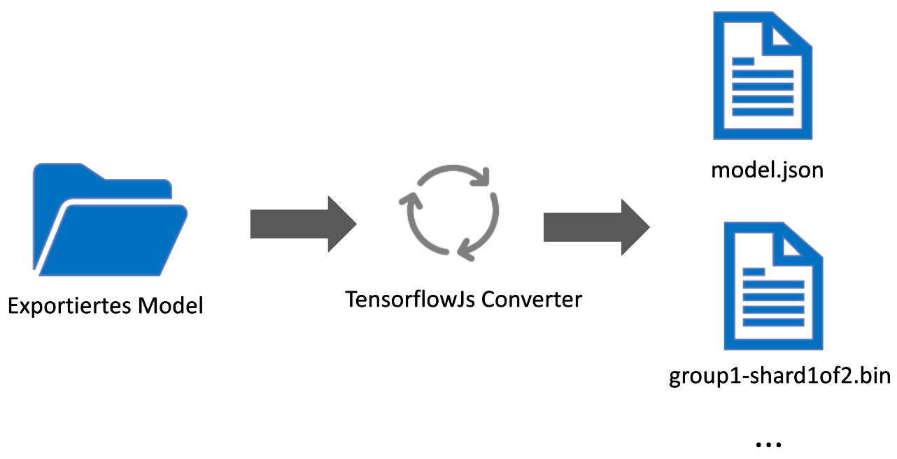
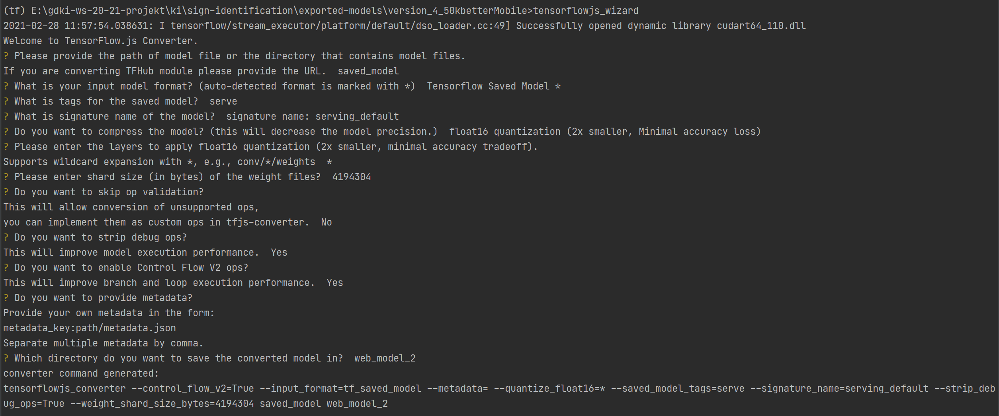
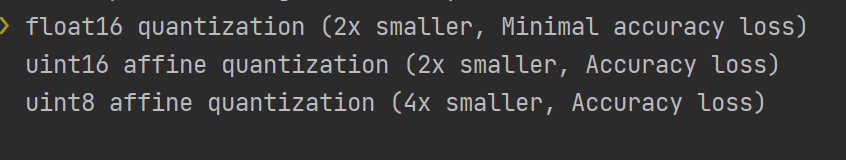

# Tensorflow JS

Um das Trainierte KI modell in React Native zu verwenden, war unsere erste
Idee [Tensorflow Js](https://www.tensorflow.org/js) zu verwenden. Da diese wird seit dem 04.02.2020[^1] eine Offiziell
unterstütztung für **React Native** bietet.

## Konvertierung

Um ein Tensorflow modell in Tensorflow Js zu verwenden muss dieses erst in ein Format Konvertiert werden welches
Tensorflow Js verwenden kann. Hierfür bietet Tensorflow
einen [Converter](https://www.tensorflow.org/js/guide/conversion) an.

{: style="height:400px;width:600px"}

Die konvertierung eines Modells funktioniert sehr einfach, die konvertierung kann mit dem
Konsolenbefehl `tensorflowjs_wizard` gestartet werden. Danach kommen eine Vielzahl von Einstellungen die vorgenommen
werden müssen:

Die Einstellungen wie oben angegeben wurden für alle unsere Tensorflow-JS Models verwendet. Es gibt zudem bereits hier
Komprimierungsmöglichkeiten. Den größten Performance Boost hatten wir mit der float16 quantization festgestellt.

Der Output dieser Konvertierung (`model.json`, `group1-shard*of*.bin`) kann man dann mit TensorflowJs laden und
verwenden (siehe [Vorhersage](#vorhersage))

## Installation

Um TensorflowJs in React Native zu Verwenden müssen einige Packages installiert werden. Eine Anleitung der Benötigten
schritte befindet sich [hier](https://www.npmjs.com/package/@tensorflow/tfjs-react-native#expo-compatibility).

!!! tip Zwar steht in der Dokumentation von TensorflowJs für React Native das einige Funktionen wie zum
Beispiel [bundleResourceIO](https://js.tensorflow.org/api_react_native/latest/#bundleResourceIO) nicht
mit [Expo](https://expo.io/) funktionieren, diese konnten wir allerdings ohne Probleme Verwenden.

!!! warning Damit [Schritt 3](https://www.npmjs.com/package/@tensorflow/tfjs-react-native#step-3-configure-metro) der
Anleitung funktioniert kann es sein das man noch das
Package [`@expo/metro-config`](https://www.npmjs.com/package/@expo/metro-config) installiert werden muss.

## Vorhersage

## Bilder/Video

## Fazit

[^1]: Quelle: https://blog.tensorflow.org/2020/02/tensorflowjs-for-react-native-is-here.html
