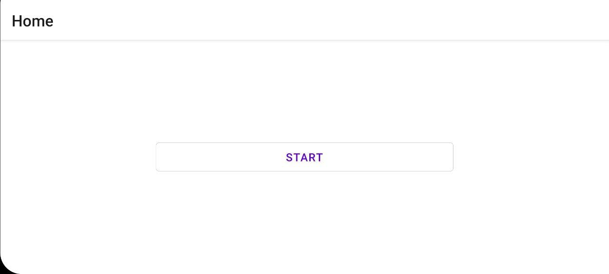
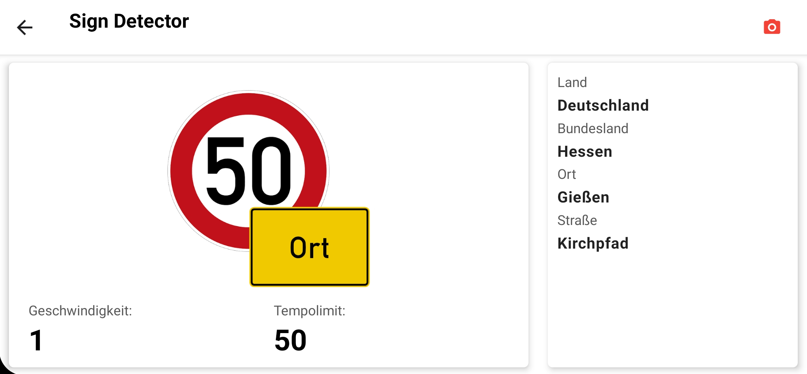
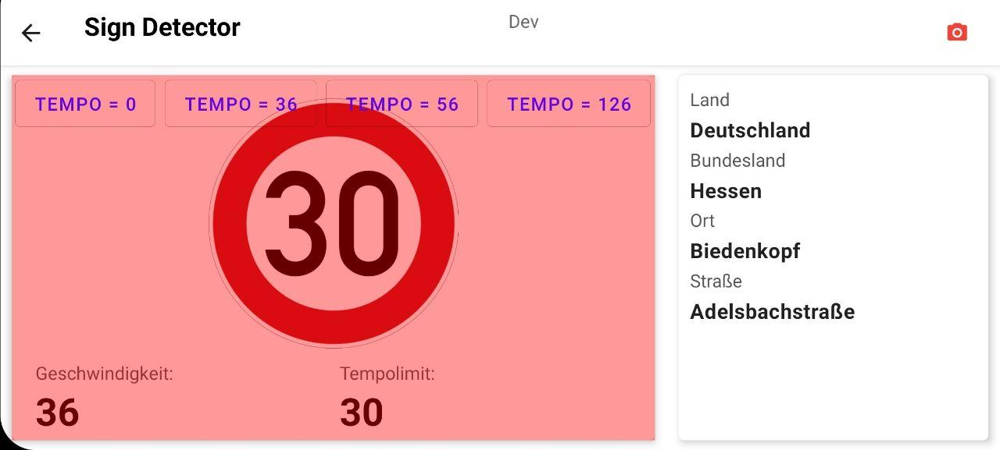
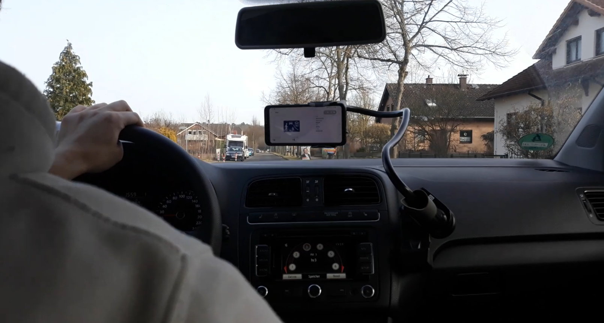
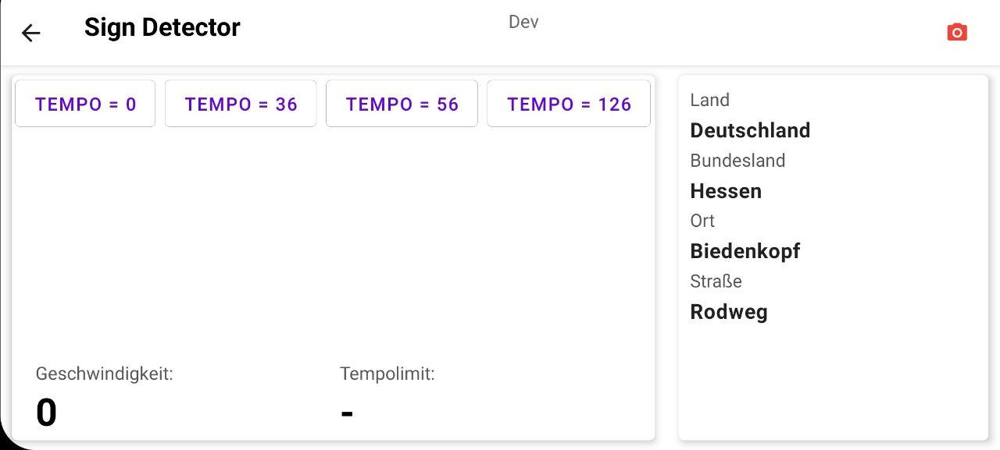

# Verwendung

Wenn man die App öffnet landet man auf dem Startbildschirm der App.

{: style="width:60%; border: 1px solid black;"}

Mit dem Klick auf Start wird die App gestartet, hierbei wird die Kammera Aktiviert und Dauerhaft ein Bild an den Backend Server gesendet.

{: style="width:60%; border: 1px solid black;"}

Erkennt die App jetzt ein Bild wird dieses in der Mitte Angezeigt, desweiteren steht unten Rechts die Aktuell erlaubte Geschwindigkeit.
Als weitere Informationen befindet sich unten links die Aktuell gefahrenen geschwindigkeit und Rechts Informationen der Aktuellen Straße.

!!! bug
    Da die aktuelle Geschwindigkeit über GPS bestimmt wird kann es sein das diese bei geringer Geschwindigkeit oder in Gebäuden nicht immer Akurat ist.

Fals die aktuelle Geschwindigkeit die erlaubte Geschwindikeit (mit einer Tolleranz von 5 Km/h) überschreitet, wird dies Audiovisuell angezeigt.

{: style="width:60%; border: 1px solid black;"}

Um die App jetzt bei der Autofahrt zu verwenden, wird die verwendung einer Handy halterung empfohlen. Diese sollte das Smartphone so ausrichten das dieses einen Möglichst guten überblick über die Straße besitzt.

{: style="width:60%; border: 1px solid black;"}

!!! note
    Beispiel Videos von der Verwendung können auch [hier](https://jannikcloud.dnshome.de/owncloud/index.php/s/kVLr4FrCosjk80z) heruntergeladen werden.

## Debug mode

Um eine Geschwindikeits änderung zu Simulieren kann auch der Debug-Modus aktiviert werden, dies geht mit einem Langen Klick auf das Kamera Symbol oben rechts. Nun können über
die erschinenen Knopfe verschidenen Geschwindigkeiten Eingestellt werden.

{: style="width:60%; border: 1px solid black;"}
