# Ki entwickeln

## Datensatz erstellen

Um einen Datensatz zu erstellen, haben wir erst einmal definiert, welche Schilder wir benötigen und diese in eine
Tabelle mit den zugehörigen Labelnamen geschrieben.  
Das Dokument finden
Sie [hier](https://github.com/GDKI-WS20-T04/traffic-sign-detection/blob/master/traffic-signs-data/SchilderTabelle.pdf)

Danach haben wir nach Datensätzen im Internet recherchiert. Dort sind wir auf einen Datensatz der University of
Copenhagen gestoßen, welcher 2158 Bilder von deutschen Verkehrschildern beinhaltet.  
Den Datensatz finden
Sie [hier](https://sid.erda.dk/public/archives/ff17dc924eba88d5d01a807357d6614c/published-archive.html).

Ebenfalls haben wir einen eigenen Datensatz erstellt, in dem wir mit dem Auto gefahren sind und mit dem Smartphone aus
der Windschutzscheibe heraus gefilmt haben.  
Diese Videos haben wir dann nach Schildern durchsucht und diese als Screenshots herausgenommen.

Im Anschluss haben wir beide Datensätze zusammengeführt und nach den Labelnamen, welche wir in der oben genannten
Tabelle definiert hatten, sortiert.

Zum Schluss mussten die Bilder dann lediglich noch gelabelt werden.

## Recherche

Bevor wir begonnen haben ein Netz zu trainieren, haben wir uns zuerst umgesehen welche Netze andere ähnliche Github
Projekte verwendet haben. Dazu haben wir uns eine Vielzahl an Projekten angesehen, haben uns aber primär an den
folgenden orientiert:

- [Road-Sign-Detection/Tensorflow-Street-Sign-Recognition](https://github.com/Project-Road-Sign-Detection/Tensorflow-Street-Sign-Recognition)
- [Traffic-sign-detection](https://github.com/aarcosg/traffic-sign-detection)
- [Real-Time-Traffic-Sign-Detection](https://github.com/Mehran970/Real-Time-Traffic-Sign-Detection)

Bei allen Projekten hatten wir festgestellt, dass primär schnelle Netze verwendet werden, damit eine Live-Detection auf
dem Handy überhaupt möglich ist. Hauptsächlich wurden dabei folgende Modelle verwendet:

- Faster R-CNN
- SSD_Mobilenet_COCO

Das Faster R-CNN hat den Vorteil, dass es Objekte schnell und zuverlässig erkennen kann. Das SSD_Mobilenet_COCO
ermöglicht jedoch eine noch schnellere Erkennung bei geringeren Hardwareanforderungen, ist dabei aber unzuverlässiger.

Da wir in erster Linie ein möglichst schnelles Netze für den Handyeinsatz entwickeln wollen, haben wir uns zu Beginn
für das SSD_Mobilenet_COCO entschieden.

## Training

### Ablauf

Das Training haben wir mit einer RTX 2070 umgesetzt, welche jedoch nur 8 GB Video-RAM besitzt und dadurch für das
Training mitunter Stunden braucht. Das Training kann in folgenden Schritten umgesetzt werden, vorrausgesetzt ist hierbei
natürlich eine Tensorflow Installation mit einer GPU Unterstützung.
[Setting up TensorFlow (GPU) on Windows 10](https://towardsdatascience.com/setting-up-tensorflow-on-windows-gpu-492d1120414c)

1. Bilder in Test / Train aufteilen

2. Tensorflow Record Dateien erstellen

3. Detection Modell von Model Zoo herunterladen

4. Training

5. Model exportieren

6. Evaluieren / Programmeinsatz

Beim Ablauf dieser Schritte haben wir uns an dieser Dokumentation orientiert:
[Training Custom Object Detector](https://tensorflow-object-detection-api-tutorial.readthedocs.io/en/latest/training.html)

Ebenso werden bei den meisten Schritten Python-Programme zur Hilfe gezogen, diese sind in der oben angegebenen
Dokumentation enthalten und wurden dann für unsere Zwecke ggf. angepasst.

Im ersten Schritt muss unser Datensatz in einen Trainings- und Test-Ordner unterteilt werden. Dies könnte
selbstverständlich auch von Hand erledigt werden, ist jedoch mit einem Programm deutlich einfacher. Dazu kann das
`partition_dataset.py` mit den Startparametern `-x -i <OrdnerPfadZuBilder> -r 0.1` verwendet werden. Nach dem Ausführen
dieses Skripts wurde dann ein Test sowie Train Ordner erstellt.

Bevor weiter gemacht werden kann, muss zuerst die Label-Datei erstellt werden. In der `label.pbtxt` File werden
alle Labels definiert die das Netz später erkennen soll. Ein Eintrag könnte so aussehen:

```js
item;
{
    id: 1;
    name: "zwanzig";
}
```

Danach können dann die Tensorflow Record Dateien erstellt werden, dazu wird das Skript
`generate_tfrecord.py` genutzt. Dies muss mit dem
Startparameter `-x <OrdnerPfadZuBilder> -l <PfadZuLabels> -o < PfadFürDieErstellteFile>\(test/train).record` ausgeführt
werden. Dieses Skript muss dann einmal für den Test, sowie den Train Ordner ausgeführt werden.

Nachdem nun die Tensorflow Record Dateien erstellt wurden, muss im Tensorflow Modell Zoo ein Modell heruntergeladen
werden([TensorFlow 2 Detection Model Zoo](https://github.com/tensorflow/models/blob/master/research/object_detection/g3doc/tf2_detection_zoo.md)).
Sobald die Wahl des Modells getroffen wurde und ein Modell heruntergeladen wurde muss dies noch entpackt, sowie in den
Projektordner verschoben werden, da wir es im nachfolgendem Schritt benötigen.

Im nächsten Schritt kommen wir nun zum eigentlichen Training des Modells. Dazu erstellen wir uns einen neuen Ordner und
kopieren die `pipeline.config` File aus dem Modell, welches zuvor heruntergeladen wurde und fügen diese in den zuvor
erstellten Ordner ein. Bevor wir das Training starten können, müssen noch Änderungen an der config Datei vorgenommen
werden:

fine_tune_checkpoint: `<Hier muss der Pfad zu dem heurngeladenem Modell eingetragen werden>`  
label_map_path: `<Der Pfad zu der Label Datei>`  
tf_record_input_reader { input_path: `<Pfad zur Train oder Test Tensorflow Record Datei>` }  
fine_tune_checkpoint_type: detection `Hier muss classification zu detection geändert werden`

Des Weiteren muss je nach Leistung der GPU noch die `batch_size` angepasst werden. Die RTX 2070 schafft beim MobileNet
V2 640x640 nur eine Batch Size von 4. Außerdem kann mit `num_steps` noch angegeben werden, wie viele Schritte das Netz
trainiert werden soll, je höher diese Zahl ist, desto besser wird das Netz (meistens, kann bei zu vielen auch wieder
schlechter werden) es wird aber auch länger dauern bis das Netz berechnet wurde. Neben diesen Änderungen können auch
noch andere individuelle Anpassungen an der config Datei vorgenommen werden. Wir hatten zum Beispiel
die `max_detections_per_class` auf 2 eingestellt sowie die `max_total_detections` auf 6. Da in den allermeisten Bildern
nicht mehr wie 6 Geschwindigkeitsschilder vorkommen sollten.

Nachdem nun die config Datei fertig angepasst wurde, kann das Training gestartet werden, dazu wird das
`model_main_tf2.py` Skript genutzt. Dies muss mit den folgenden Startparametern aufgerufen werden:
`--model_dir= <Pfad zu meinem Modell> --pipeline_config_path= <Pfad zur eben erstellten config Datei>`

Je nach gewähltem Modell und der Anzahl der Batches dauert es jetzt ggf. mehrere Stunden bis das Programm beendet wurde
und das Netz erstellt wurde. Da im Laufe des Programms Checkpoints gespeichert werden, kann das Programm gestoppt, und
zu einem späterem Zeitpunkt erneut gestartet werden. Mithilfe der Checkpoints beginnt das Programm dann bei einem
Neustart bei der letzten Speicherung, dadurch ist es nicht nötig wieder von vorne zu beginnen.

Des Weiteren kann während des Trainings der Trainingsfortschritt live verfolgt werden mithilfe des
Tensor-Boards: `tensorboard --logdir=<Pfad zum Modell>`
Im Tensor-Board befinden sich eine Vielzahl an Grafiken, die den Trainingsfortschritt darlegen.

Nachdem das Model dann fertig ist, kann es exportiert werden, dazu wird das `exporter_main_v2` Skript genutzt. Auch dies
wird wieder mit Startparametern ausgeführt:

```sh
--input_type image_tensor
--pipeline_config_path <Pfad zur eben erstellten config Datei>
--trained_checkpoint_dir <Pfad zum erstelltem Modell>
--output_directory <Ort an dem das Modell gespeichert wurde>
```

Nach dem Exportieren befindet sich in dem Output Directory ein Modell Graph sowie ein Checkpoint. Beides kann im
nächsten Schritt verwendet werden, um das Modell zu evaluieren.

Nach dem Training muss jedes erstellte Netz selbstverständlich evaluiert und mit anderen Modellen verglichen werden.
Dazu testen wir das Netz mit neuen Bildern, die bisher noch nicht genutzt wurden. Für das Evaluieren haben wir uns sehr
viel Zeit genommen und verschiedenen Programme geschrieben die:

- einzelne Bilder evaluieren
- ein Video evaluieren
- Bilder evaluieren und Scores berechnen.

Bilder können mit dem Programm `plot_object_detection_model` getestet werden. Das Programm speichert die eingegebenen
Bildern mit Labels der erkannten Objekte. Im Programm gibt es Pfade zu dem Modell, Testbildern sowie zu den Labels die
ggf. angepasst werden müssen.

Videos können mit dem Programm `plot_object_detection_model_video` analysiert werden, dieses Programm analysiert jeden
Frame des Videos, labelt diesem mit den Wahrscheinlichkeiten das ein Schild erkannt wurde und baut zum Schluss wieder
ein Video zusammen.

Neben diesen Evaluierungsmöglichkeiten, haben wir zusätzlich auch noch ein Programm geschrieben, dass eine Reihe von
Testbildern analysiert und einen Score berechnet wie gut das Modell funktioniert hat. Diese Programme
sind `model_comparison.py` und `model_comparison_2.py`. Der Unterschiede der beiden ist lediglich, dass im einen der
erstellte Graph geladen wird und im anderem der Checkpoint. Der Score wird berechnet aus den Wahrscheinlichkeiten der
erkannten Bilder. Ein höherer Score bedeutet somit eine besseres Netz.

## Versionen

Den oben beschriebenen Ablauf haben wir nun für mehrere Netze angewandt, welche hier noch einmal näher erläutert werden.

Begonnen haben wir mit einem SSD MobileNet V2 FPNLite 640x640. Die Einstellungen haben wir hier nicht weiter angepasst,
außer das wir die Steps auf 20.000 reduziert haben, um etwas schneller bereits ein Ergebnis zu haben. Das Ergebnis war
auch bereits einigermaßen zufriedenstellend.

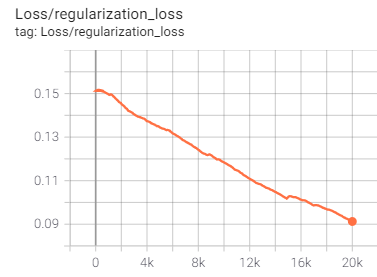{: style="width:49%"}
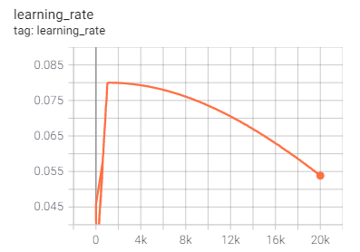{: style="width:49%"}

Das Compare Skript kam bereits auf folgende Werte:

- 12 / 25 Bilder erkannt
- 7,19 Punkte
- 28,3 Sekunden Laufzeit

Hier 2 Beispiel Bilder:

{: style="width:80%"}
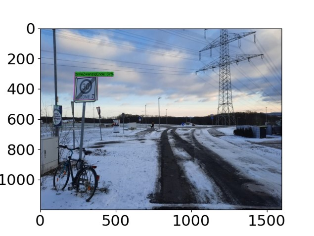{: style="width:80%"}

Das Zone 30 Ende Schild wurde zwar falsch erkannt, aber auch nur mit einer sehr geringen Wahrscheinlichkeit. Das
Dreißiger Schild wurde ebenfalls zwar erkannt aber auch noch relativ unsicher.

Nachdem das erste SSD MobileNet V2 FPNLite 640x640 mit 20.000 Schritten schon gut funktioniert hatte und wir am
Trainingsverlauf(Lernrate) gesehen hatten das noch potenzial besteht, haben wir das Model erneut durchlaufen lassen.
Dieses Mal dann aber mit 50.000 Steps. Auch hier wieder der Trainingsverlauf im Tensor-Board:

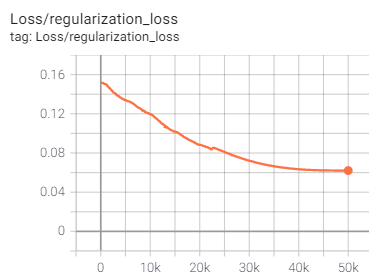{: style="width:49%"}
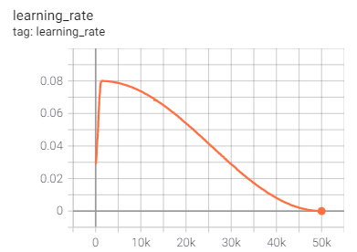{: style="width:49%"}

Das Compare Skript kam bereits auf deutlich bessere Werte:

- 18 / 25 Bilder
- 15,74 Punkte
- 17,76 Sekunden

Auch hier wieder die zwei Beispiel Bilder:

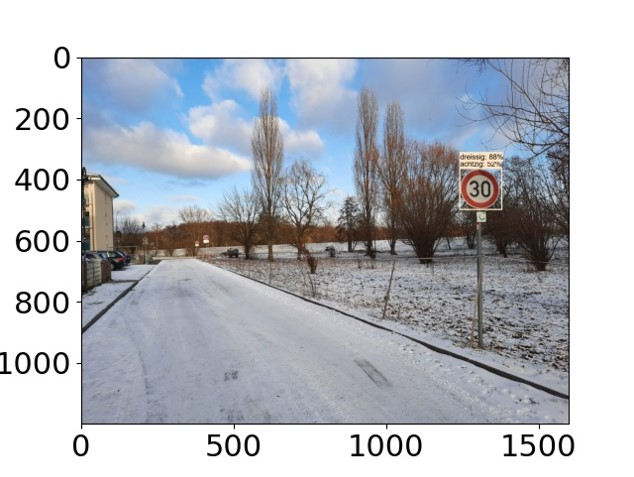{: style="width:80%"}
{: style="width:80%"}

Wie man erkennt werden die beiden Bilder schon deutlich sicherer und jetzt auch richtig erkannt als zuvor. Jedoch
besteht hier noch Verbesserungspotenzial. An der Lernrate haben wir jedoch festgestellt das noch mehr Steps zu nichts
mehr geführt hätten.

Als Nächstes haben wir dann ein Faster R-CNN ResNet101 V1 640x640 versucht. Hier sind wir aber leider auf das Problem
gestoßen, dass die RTX 2070 nicht genug Video-RAM besitzt, um das Training durchzuführen.

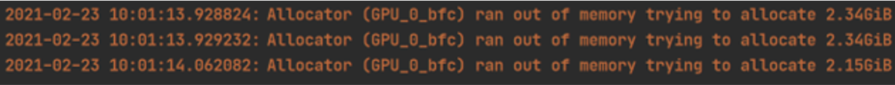{: style="width:100%"}

Als alternative hätten wir das Netz auch auf Google Colab berechnen lassen können. Wir haben uns dann aber dafür
entschieden ein Faster R-CNN ResNet50 V1 640x640 zu nutzen. Dieses funktioniert auch mit nur 8 GB Video-RAM. Dieses Netz
hat jedoch auch nicht funktioniert, was mitunter auch daran liegen könnte, dass wir doch einen sehr kleinen Datensatz
mit nur 1000 Bilder hatten. Die Lernrate klingt zwar plausibel, ist aber längst nicht so hoch wie beim SSD MobileNet.

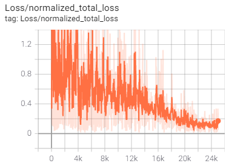{: style="width:49%"}
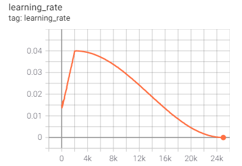{: style="width:49%"}

Das Compare Skript kam auf folgende ernüchternde Werte:

- 1 / 25 Bilder
- 0,005 Punkte
- 17,04 Sekunden

Das Netz funktioniert nicht wirklich. Hier haben wir versucht das Netz noch einmal mit anderen Einstellungen zu starten,
was jedoch nicht zum Erfolg geführt hat. Da wir nicht allzu viel Zeit investieren wollten, um ein nicht funktionierendes
Netz zum Laufen zu bekommen, haben wir uns dann entschieden unser SSD MobileNet zu verbessern.

Da wir in unserem Datensatz einige sehr schlechte Bilder hatten, auf welchen selbst ein Mensch keine Zahl auf dem Schild
erkennen konnte, haben wir uns entschieden diese aus dem Datensatz zu entfernen. Mit diesem überarbeitetem Datensatz
haben wir dann das SSD MobileNet V2 FPNLite 640x640 noch einmal trainiert. Die Resultate haben sich dadurch dann noch
einmal verbessert. Der Trainingsverlauf war identisch mit dem vorherigem SSD MobileNet. Die Resultate der Testbilder
haben sich zudem noch einmal verbessert:

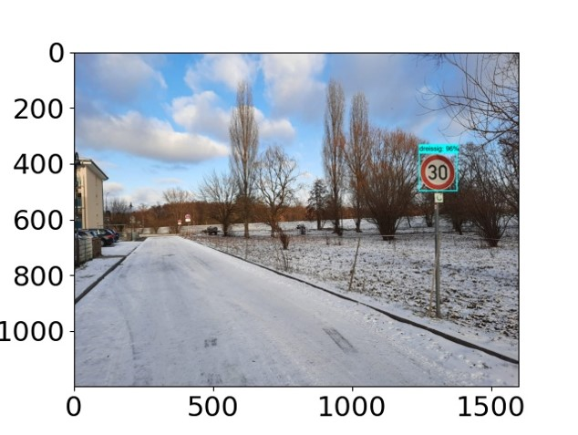{: style="width:80%"}
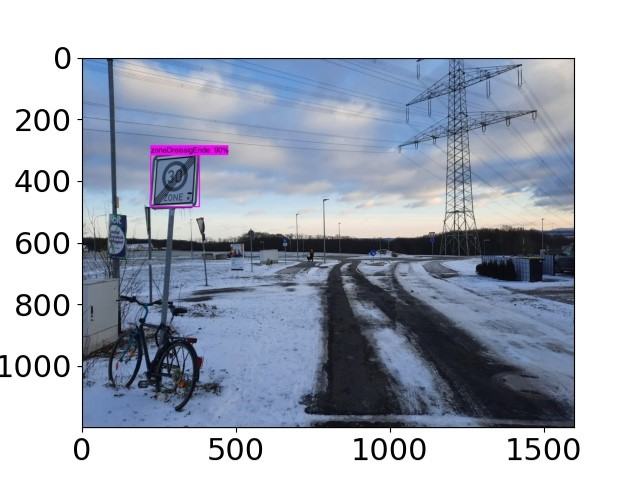{: style="width:80%"}

Auch das Compare Skript hat dieses Netz noch einmal bessert bewertet:

- 19 / 25 Bilder
- 16,4 Punkte
- 17,77 Sekunden

Da wir bisher nur Modelle mit einer Auflösung von 640x640 trainiert hatten, wollten wir auch noch einmal ein Netz mit
einer geringeren Pixelanzahl trainieren. Dabei haben wir uns für ein SSD MobileNet v2 320x320 entschieden. Wir waren uns
aber bereits vor dem Training unsicher, ob das Netz überhaupt funktionieren kann, da bei diesen wenigen Pixeln nicht
viel zu erkennen ist. Dies hat sich dann auch im Trainingsverlauf dargelegt.

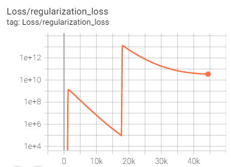{: style="width:49%"}
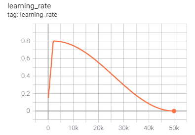{: style="width:49%"}

Auch das Compare Skript hat ergeben, dass das Netz nicht wirklich funktioniert:

- 0 / 25 Bilder
- 0 Punkte
- 16,35 Sekunden

Das Compare Skript hatte unsere Vermutung bestätigt, dass mit dieser geringen Pixelanzahl keine Objekterkennung
funktioniert. Hier hätte man ggf. 2 Netze nutzen müssen. Das erste müsste nur das Schild erkennen und das zweite dann
dass Schild klassizieren. Da wir dazu aber den gesamten Datensatz umbauen müssten haben wir in der App dann, dass beste
SSD MobileNet V2 FPNLite 640x640 genutzt.

## Falsche Verkehrszeichen

Zum Testen unsere KI haben wir zum einen bei Google nach einem Werbeplakat gesucht, welches einem Verkehrsschild ähnlich sieht.

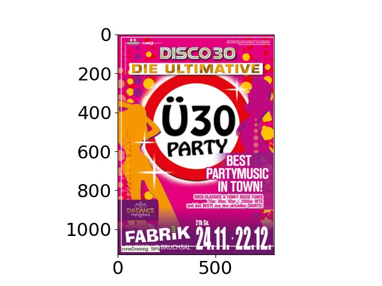{: style="width:80%"}

Wie unten links zu erkennen, wurde dieses Bild mit einer Wahrscheinlichkeit von 58% als Zone30-Schild erkannt.

Das nächste Testbild, ist uns beim tatsächlichen Testfahren untergekommen.

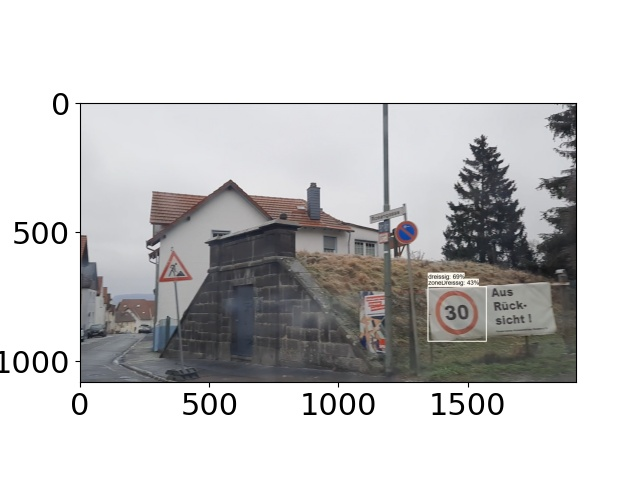{: style="width:80%"}

Hier wurde zu 69% ein 30-Schild und zu 43% ein Zone30-Schild erkannt.

Das letzte hier gezeigte fehlerhafte erkannte Verkehrsschild ist ebenfalls bei einer Testfahrt entstanden. Hier wurde ein Wahlplakat zu 59% als Spielstraße erkannt.

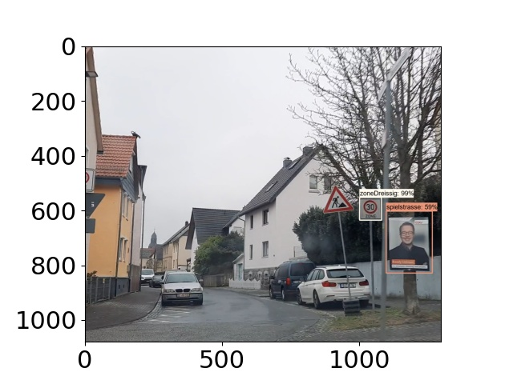{: style="width:80%"}

Da unsere App nur Schilder mit einer Wahrscheinlichkeit von 80% oder höher anzeigt, wären diese Schilder für uns kein Problem.