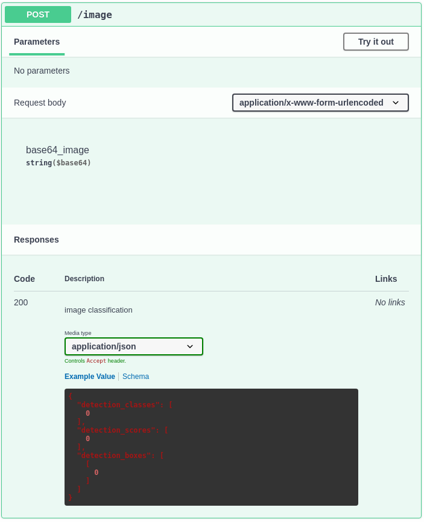

# Server 

Der Server stellt eine Route bereit, welche POST-Requests annimmt.  
Diese Route ist unter der url "/image" zu erreichen und erwartet im `body` der Anfrage ein in base64 encodiertes Bild.

!!swagger openapi.yaml!!

{: style="width:100%;"}